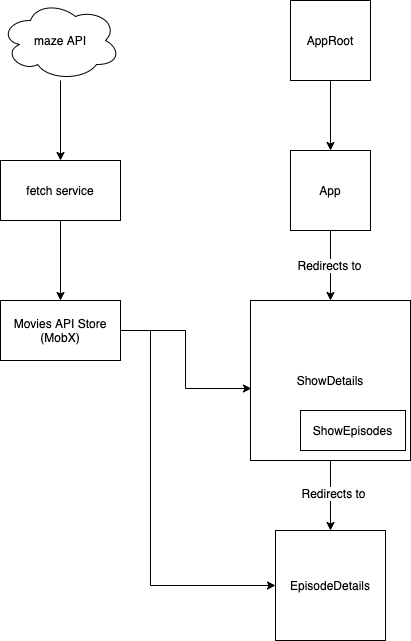

# Movie app

## Tech-stack

- React
- React-Router
- MobX
- Material UI

## Components

- AppRoot -> Initialises the router and the stores provider
- App -> Displays <ShowDetails /> or <EpisodeDetails /> depending on the router path location
- ShowDetails -> Display details about a show, along with <ShowEpisodes />.
- ShowEpisodes -> Displays a list of episodes for a selected show
- EpisodeDetails -> Displays details about a given show (recognised through its id)

## Technical Decisions

- MobX was selected as a store solution for its simplicity and observability. I find that expressing state is easier with it, with everything being encapsulated in classes. Its reactive nature also assures a constant data flow across components, without triggering too many actions manually.
- Material-UI is almost an industry standard when it comes to React UI libraries. It has a very intuitive, uniform API interface.
- There are a couple of abstraction layers:
  1. fetch is covered by a facade (for mocking in tests and simplifying its interface when using it in the stores). 
  2. The DataFetcher is a specialised and tiny rich domain model used in the stores. Its only concern is with fetching and loading the data and eventually reporting errors, thus encapsulating every endpoint request with its own set of statuses and data accessors.

## The data flow

This is a very simplistic overview of how the data flows in the app, and the layout of its components:

## What is missing from this project

- Unit tests for most of the project (I only wrote one for each type of module (component, service, store))
- Integration tests (cypress or wdio)
- Less hardcoded values in the stores (especially endpoints), should be in a config file. 